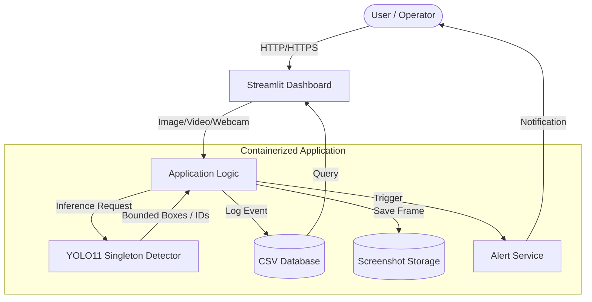
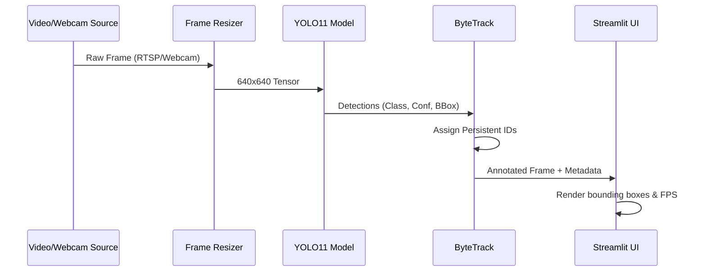
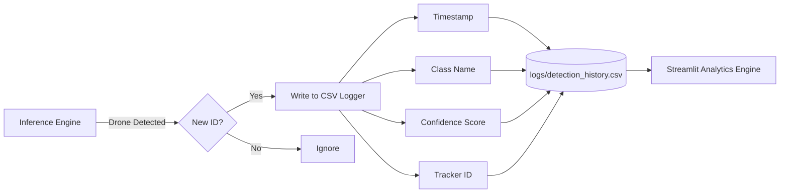
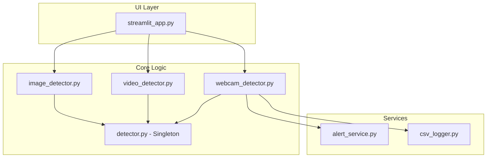
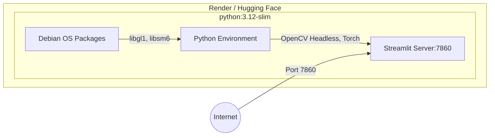

# System & Software Architecture

This document outlines the architectural design, data workflows, and AI model specifics of the Smart Drone Detection System.

---

## 1. Overall System Architecture

The system is designed with a monolithic, containerized architecture that bundles the frontend dashboard, backend services, and the AI inference engine into a single deployable unit.

---

## 2. Detection & Inference Pipeline

The core detection loop is highly optimized. It uses ByteTrack for temporal consistency across frames to ensure a single drone is not counted multiple times as it moves across the screen.

---

## 3. Data & Logging Workflow

Every detection event generates structured data for analytics and forensics.

---

## 4. Application Component Diagram

Illustrates the modular decoupling within the Python codebase.

---

## 5. Deployment Architecture

The application is containerized using Docker, allowing seamless deployment to Linux environments like Render or Hugging Face Spaces.

---

## 6. AI Model Documentation (YOLO11)

The system relies on Ultralytics YOLO11, the state-of-the-art in single-shot object detection.

### **Architecture Highlights**
- **Backbone:** CSPDarknet53 (Cross Stage Partial Network) for feature extraction.
- **Neck:** PANet (Path Aggregation Network) for multi-scale feature fusion.
- **Head:** Decoupled head for separate bounding box regression and object classification.

### **Inference Details**
- **Classes:** 0: Aircraft, 1: Bird, 2: Drone
- **Default Confidence Threshold:** 0.25 (Configurable via UI)
- **Tracking Algorithm:** ByteTrack (Configured via `bytetrack.yaml`)

### **Prediction Flow**
1. **Input:** Standardized to `640x640` spatial dimensions.
2. **Forward Pass:** The model outputs an Nx6 tensor (x_center, y_center, width, height, confidence, class).
3. **NMS (Non-Maximum Suppression):** Filters overlapping bounding boxes based on the IoU (Intersection over Union) threshold.
4. **Tracking:** ByteTrack associates detections in the current frame to existing tracklets from previous frames using Kalman Filters.
